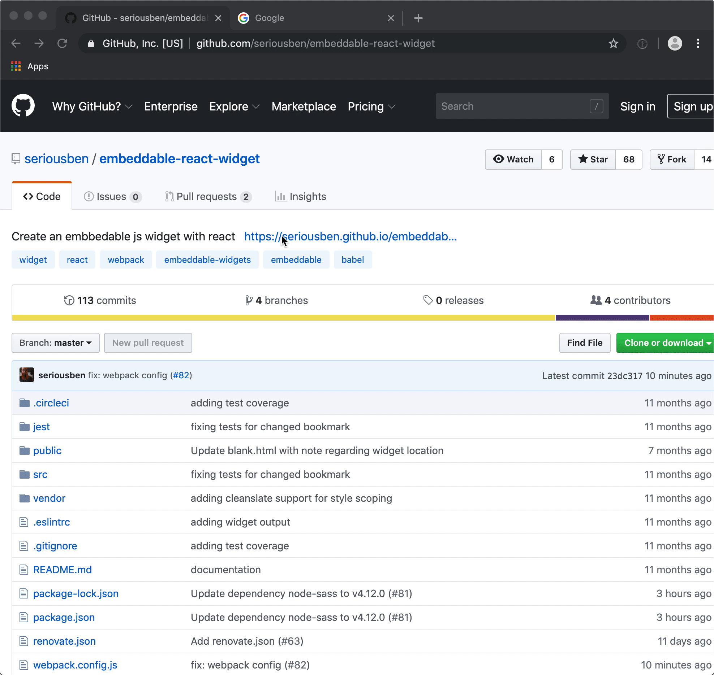

<div align="center">
<h1>Embeddable React Widget</h1>

Easy creation of embeddable widgets - https://seriousben.github.io/embeddable-react-widget

[](https://circleci.com/gh/seriousben/embeddable-react-widget)
[](https://codecov.io/gh/seriousben/embeddable-react-widget)
[](https://renovatebot.com/)

</div>

## Features

* Full ES6/ES2015 support (with Babel)
* Package fonts, css, json, javascripts together into one single package (with Webpack)
* No css styling conflicts between the host page and the widget (with https://github.com/premasagar/cleanslate)
* Bookmarklet supported for fast testing and demonstration
* User theming of widget
* Obfuscating of the widget code
* Unit Tested with code coverage enabled
* Continuous Integration ready

## Demo



## Running the widget

### Install dependencies

```sh
$ npm install
```

### Start the development server

```sh
$ npm start
... server running at http://localhost:8080/
```

### Run tests
```
$ npm test
... test output
```

### Production build
```
$ npm run build
... create files in /dist
```

## Roadmap

- [x] Widget as react app - index.html works (webpack, babel, react)
- [x] React widget (widget builder)
- [x] Webpack changed to output a library
- [x] Add tests
- [x] Add circleci integration
- [x] Add codecov integration for codecoverage
- [x] Production Build
- [x] Minified
- [x] Add greenkeeper
- [x] Bookmarklet
- [x] Reset / Cleanslate / No-conflicts of styles
- [x] Obfuscation
- [ ] Theming support
- [ ] Storyboard and docs
- [ ] Integrate eslint with webpack

## Background

### What is an embeddable widget?

* Usable using a simple `<script>` tag
* Configurable with code
* Themable

### Why not in an iframe?

* Interaction between the frame and the hosting page is tricky and not recommended
* You can only display content within the iframe
* iframe and content resizing is impossible
* iframe sandboxing can result in missing functionalities

### Read more

Read more about about widgets, react and scoping of css.

* https://www.robinwieruch.de/minimal-react-webpack-babel-setup/#hot-module-replacement
* https://codeburst.io/building-react-widget-libraries-using-webpack-e0a140c16ce4
* https://github.com/timarney/react-app-rewired
* https://github.com/premasagar/cleanslate
* https://github.com/krasimir/third-party-react-widget
* https://github.com/jenyayel/js-widget
* https://github.com/anakinjay/react-widget-starter
* https://webpack.js.org/guides/author-libraries/
* https://github.com/webpack-contrib/webpack-serve
* https://medium.freecodecamp.org/part-1-react-app-from-scratch-using-webpack-4-562b1d231e75
* https://github.com/facebook/create-react-app/blob/next/packages/react-scripts/config/webpack.config.prod.js
* https://github.com/webpack-contrib/purifycss-webpack
* https://medium.com/quick-code/from-zero-to-deploy-set-up-react-stack-with-webpack-3-20b57d6cb8d7
* https://medium.com/dailyjs/building-a-react-component-with-webpack-publish-to-npm-deploy-to-github-guide-6927f60b3220
* http://krasimirtsonev.com/blog/article/javascript-library-starter-using-webpack-es6
* https://github.com/javascript-obfuscator/webpack-obfuscator
* https://github.com/tsileo/embedded-js-widget
* https://thomassileo.name/blog/2014/03/27/building-an-embeddable-javascript-widget-third-party-javascript/
